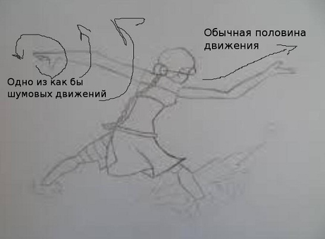
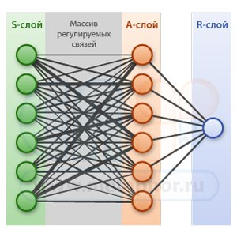
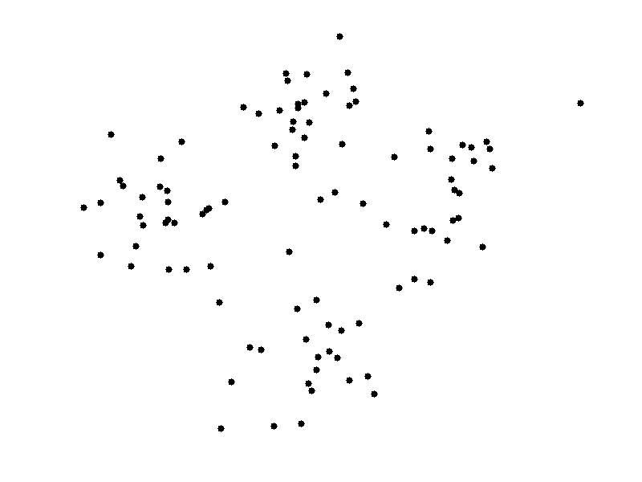

Research project. Proposal for conservative treatment of scoliosis use Machine Learning ideas
(Предложение по консервативному лечению сколиоза используя методы Машинного обучения)
До этого ничего пободного не встречал и решил описать его здесь, может гугл для кого-то найдет. Изначально идея разрабатывалась как помощь одному моему товарищу.

#####Известные технологии:
- Метод Катарины Шрот. Основан на довольно необычной идее. Некоторые россияне считаю этот метод шерлотанством, но он 
широко используесят в Германии и Израиле - а у них медицина все же на высоте. http://www.ecsto.ru/news/2848 - рандомная гуглоссыль
- **http://www.spinalis.ru/aboutus.htm** - !
- http://b2blogger.com/pressroom/186746.html
- http://skoliose.ru/fits/

**Core idea:** (superv + non-superv) + NN + regul + opt algorithms + (механика рассеивания накопленной энергии + заколение мышц)

Итого нужно начальное приближение, многовариантные движения и отключить мозг.  Достаточно, когда делаешь какие-то упражнения, качать головой, или/и что-то делать кистями рук, или пальцами. Это и мозг отключает или отвлекает и это безопасно, к тому же движения становятся 
сложнее за счет того что повторить точно не можешь, а разновариантных микродвижений становится много. 
Итого +100 к ловкости - то что нужно. И как-то постепенно начинаешь делать правильно. Это помогает 
пройти вот ту точку когда типа кровь густеет, и мозг уже не может ничего контролировать, но контроль 
в сам метод и не заложен, а начальное приближения особых размышлений не требуют, как и неточные 
движения. Плюс это помогает обойти тучу проблем, которые не указал, они больше с головой связаны 
(депрессивность, приступы злобы и безысходности, самообман и самовнушения и прочее), 
а раз мозг отключен, и дела идут быстро в гору, а значит успокоить себя легче. Очень важно то что такие искаженные движения повторяемые, такого не было до этого никогда - один и тот же помплекс без изменений не помогал дваждны ни разу.

Начальные приближения может быть любым. Например, тай-чи 24-форма. Комплексу сотни лет - 
лажы там скорее всего нет. Может кому-то нравятся танцы. Важно скорее не что а как.
http://www.youtube.com/watch?v=qV6PjN55Lb4&list=LLORkb6XxvxHXaX9Kb9DB_iw&index=53, 
http://www.youtube.com/watch?v=1ztMYYV7TVY
В папке есть книжка, в ней разминка и движения для 24-формы. Описания можно не читать, все 
равно не запомнить. Разминку можно делать крутя головой и шевеля пальцами, или крутя ладонями, 
впрочем как и сам комплекс. Мульняшные картинки немного устаревшие - описанный вариант далеко не 
первый - шумовых движений ладонями, пальцами и головой достаточно, но можно еще добавлять, хуже не будет.

####Объяснения и разъяснения

Ниже модель нейронной сети. По сути обучение это рекулировка весов связей - они выделены серым.

!! на гифке очень резкие перемещений - не надо так!

FIXME: Может и не так. Может просто при обучении с учителем в нейронной сети много локальных минимумов.
*Моя версия почему что делалают часто не срабатывает.* Цитатка есть - **"The mind can be a powerful ally or
your greatest enemy"** - разум может быть могущественным союзником или великим врагом - в 
данной проблеме вариант второй. Немного теории. Я проходил курсы по машинному обучения на Coursera (Andrew Ng) и оптимизации алгоритмов машинного обучения, после чего появились некоторые логичные объяснения. Есть по сути два 
метода обучения программ - **с учителем (supervising) и без учителя (unsupervising)**. 

Опишу метод "с учителем" на примере распознавателя лиц (скорее всего это программа-нейронная-сеть - это модель нервной системы человека). Есть входные данные (куча фоток разных людей) и верные ответы (например для каждой фотки ответ есть/нет Васи Ивановна ней). Есть тестовые данные - для которых нет таких отметок. И программа в итоге должна сказать есть Вася на любой фотке или его там нет с некоторый вероятностью ошибки.
- Сперва программа учится - ей "показывают" фотку и верный ответ и она как-то учится - 
это алгоритм обучения (train) - для нейронных сетей это, например, 
Метод обратного распространения ошибки
- Потом проверяют на тестовых дынных - "показывают" фотку, а программа дает ответ - 
это алгоритм предсказания (predict)
- А потом просто работает - тоже predict

Обучение без учителя принципиально другое. На входе какие-то данные, а задача найди структуры в 
данных (например центры кристаллов - в гифках в папку иллюстраций). Можно сказать идея - 
сходи туда не знаю куда, принеси то не знаю что. Но есть некоторая неточная наводка - 
нулевой приближение. И ни каких других предположений - это важно! очень!!
- Подаются тренировочные примеры - правильный ответов нет
- Программа учится - train - например, используя алгоритм k-means - на гифках показано как он работает.
это не для нейронный сетей, но нагляднее
- После этого показывает что нашла - см. гифки.

Если обучение с учителем и нейронная сеть не обученая (см. связи на картинке) и сложная, то если ее обучать на 
простых примерах возникает такая штука как оверфиттинг - она хорошо узнает тренировочные примеры и сильно врет на новых - поэтому движения нужно усложнять. Даже при усложнении, например, при добавлении новых упраженений наступить тупик. Плюс тело не просто не помнит движения, а оно их еще искажает. Если без учителя, то все упрощается. Если его применить (задать начальное приближения и делать что-то), то без особого участия мозга правильные движения сами выкристаллизуются. Почему это работает с медицинчкой точки зрения точно не знаю. Для обоих методов есть специальные алгоритмы обучения (train) - что-то подобное есть и в человеке, и возможно с учителем прокатывает, и похоже сам алгоритм обучения сломался или веса нейронов(см. связи на картинке)
 стали перекащивать движения, а тот что без учителя еще работал, может на интуиции какой-то. Может что-то с фокусировкой внимания. Или может активирует мозг. Или мозг становиться очень тоталитаными и начинает как бы прорисовывает движения, но при этом осознанно правильные движения не помнит напрочь, а обучение без учтеля как бы 
"затопляет" сознание, и оно не мешает. Или мозг защищает от движений вообще. Еще возможно мелкие движения рассеивают энергию запасаемую в искривленных мышцах.

Как "переключить" метод обучения? Что-то порой получалось, но почему это работало точно не знали, и в итоге переключался на первый метод и все начиналось с начала. См выше.

На общность не претендую. Такое решение для конкретного случая. В 
итоге 2-3 недели и уже много-много лучше, если не сбиваться с пути, о чем ниже, даже меньше.

Критическое замечание(но это так же допускает вероятность ошибок, в многом все написанное включает в себя возможность ошибаться, в программирование это называется fault tolerant)
Разум здесь - враг. И точка. Думаю все равно почему так. Эмоции отнимают много энергии, а ее будет очень нехватать,но позитивные очень важны потом (строчка отличается от исходной). А друг - это похоже интуиция. Вобщем разум будет пытаться вернуть свою "власть". Если пошло не так, то с вероятность 99% мозг опять начал мешать. Нужно проверить, что не пытаешся подгонять или подправить движения, это переключения на обучение с учителем и это путь обратно. Если движение не вышло, не нужно пытаться его подправить, просто заново повторить. К тому как и что 
делаешь нужно относиться безразлично и по раздолбайски - абыкак - но с шумовыми движениями. Это 
отношение тоже добавляет варианты движения и защищает от оверфиттинга. Далее. Конктерные шумовые 
движения через некоторое будет переставать действовать мозг научится их обходить (движения становятся 
как бы прорисованными) - разминку обсчитает быстро, но сам комплекс не так быстро, но это не так страшно. 
Возможных движений голова мало - 4 думаю, а вот руками можно делать кучу всего разного - вращать 
кистями и/или шевелить пальцами, шевелить разными пальцами, барабанить пальцами по ляжками итп. 
Т.е. делаешь те же самые упражнения, но руками делаешь разное. Тадам. Это замечание основано на 
огромной, собранной за годы статистике.

Other notes:

Andrew Ng "добавление статистики часто улучшает качество алгоритма". тут не статистика движения, а статистика НА движениЕ 
- шум и раздолбайство это дополнительные похоже репрезентативные сэмплы

Упражнения имеют фазы, но шумовые должны быть и при переходах из фазы в фызу.
Если больно можно уменьшать амплитуды и время. Обостряться будет! чем меньше амплитуда шумовых движений тем лучше - мозг как бы прислушиватеся - если говорить шепотом

FIXME: 1 и 2 степени?

FIXME: убрать лишнюю лирику

FIXME: побольше узнать про посттравмотический стресс, травматическая память, психологическая упругость, факторы риска (google: Израиль постр стресс)

FIXME: сделать похожей на научную статью. убрать грамматические ошибки. перевести на английский
убрать программистский слэнг. Ооочень сложно написано

FIXME: Картинка для k-means - почему-то запускатеся только раз - про нее ниже, не знаю как сделать чтобы зациклилась

FIXME: добавить про регуляризацию и регулялизующий множитель, локальные минимуму нейронных сетей https://www.coursera.org/instructor/andrewng

FIXME: делать не 123321 а 1112223332222111 - асимметрично

// FIXME: со временем нужно повышать нагрузку! только разминки и тайчи будет мало - обычная растяжка, и типа пресс
// - нет если мало то нужно уменьшать амплитуды движений иначе это превращается в мануальную терапию
// - нет это тупики оба, они противоречат тому что написано

**FIXME: вертикальность(бег на носках) + горизонтальность(Тай Чи) + общеукрепл ("Uptown Abs workout at Gymtastics Gym Club")**

FIXME: http://www.youtube.com/watch?v=h38hfW8-kOQ - некоторые из разминки тайцзы помечены как вредные, 
а некторые полезные. Кстати в разминке тай нет поворотов головы

FIXME: почитать про EMDR

FIXME: to Ng

FIXME: case stories
